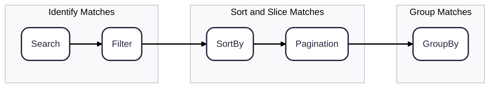

# Rules

"Rules" are static definitions that tell Finder how to interact with the unique shape of your Items objects. Finder will use that information to determine what internal state to track.

Each set of rules has a corresponding api to access and mutate their state.

| Rule                                  | API                                   | Purpose                                                                                          |
| ------------------------------------- | ------------------------------------- | ------------------------------------------------------------------------------------------------ |
| [SearchRule](../rules/search-rule)    | [finder.search](../api/search-api)    | Determine which properties in your Item should be searchable.                                    |
| [FilterRule](../rules/filter-rule)    | [finder.filter](../api/filters-api)   | Determine what filter predicates are required, and how they should be tested against your Items. |
| [SortByRule](../rules/sort-by-rule)   | [finder.sortBy](../api/sort-by-api)   | determine what order your Items should be displayed in.                                          |
| [GroupByRule](../rules/group-by-rule) | [finder.groupBy](../api/group-by-api) | determine how to categorize your Items                                                           |

## Rule Processing Order

- During the **Identify Matches** phase, items are tested against _all_ active Search and Filter rules. Any mismatches are discarded.

- In **Sort and Slice Matches**, surviving items are ordered and paginated. This phase is skipped if no SortBy rules are active and pagination is not enabled.

- Lastly, we **Group Matches** if a GroupBy rule is active. The searched + filtered + sorted + paginated items array is grouped by a common property defined in the GroupBy rule.
